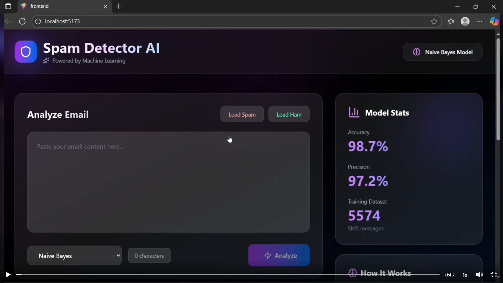
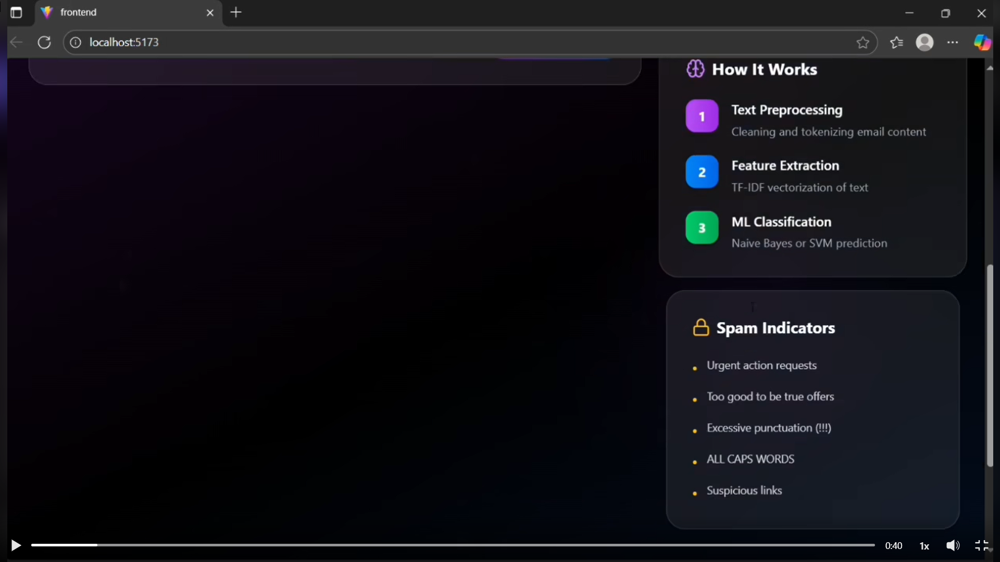
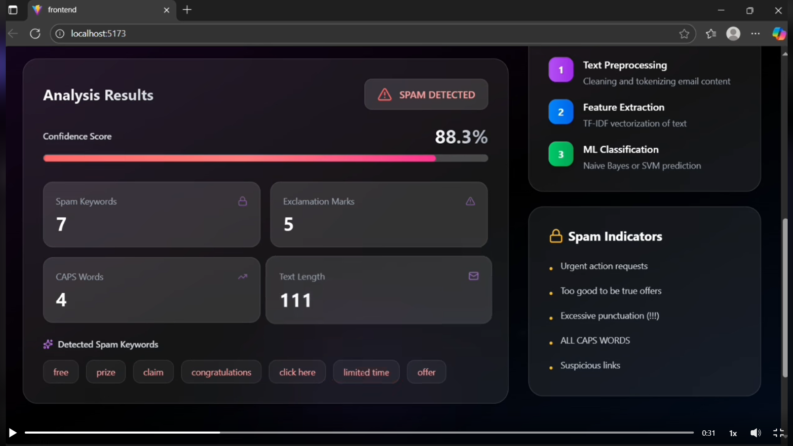
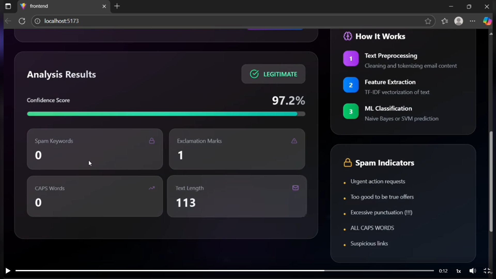

# 📧 Spam Detector

<div align="center">


**An intelligent email spam detection system powered by Naive Bayes & SVM machine learning models, served via a Flask REST API with a modern frontend interface.**

[🚀 Demo](#-demo) · [📖 Documentation](#-how-it-works) · [🛠️ Installation](#-installation) · [🤝 Contributing](#-contributing)

</div>

---

## 🖥️ Demo

### Main Interface — Analyze Email

> Paste any email content, choose between **Naive Bayes** or **SVM** model, and hit **Analyze**. Model stats (98.7% accuracy, 97.2% precision, 5574 training samples) are displayed live on the right panel.

---

### How It Works Panel + Spam Indicators

> The sidebar explains the 3-step ML pipeline: **Text Preprocessing → Feature Extraction (TF-IDF) → ML Classification**, plus a list of common spam signal patterns the model detects.

---

### Analysis Result — ⚠️ SPAM DETECTED

> When spam is detected, the result card shows a **confidence score (88.3%)**, breakdown of spam signals (keywords, exclamation marks, CAPS words, text length), and highlights the exact **detected spam keywords** like `free`, `prize`, `claim`, `congratulations`, `click here`.

---

### Analysis Result — ✅ LEGITIMATE

> For clean emails, the result shows **LEGITIMATE** with a high confidence score (97.2%) and zero spam keywords or CAPS words detected.

---

## 📌 Table of Contents

- [Overview](#overview)
- [Features](#features)
- [Tech Stack](#tech-stack)
- [Project Structure](#project-structure)
- [How It Works](#how-it-works)
- [Installation](#installation)
- [Usage](#usage)
- [API Reference](#api-reference)
- [Model Performance](#model-performance)
- [Contributing](#contributing)
- [License](#license)

---

## 🧠 Overview

**Spam Detector** is a full-stack machine learning application that classifies emails as **spam** or **ham (not spam)** in real time. It leverages two powerful ML classifiers — **Multinomial Naive Bayes** and **Support Vector Machine (SVM)** — trained on a labeled email dataset, and exposes predictions through a clean Flask REST API consumed by a responsive frontend.

---

## ✨ Features

- 🔍 **Dual Model Prediction** — Uses both Naive Bayes and SVM for classification
- ⚡ **Real-time Detection** — Instant spam/ham prediction via REST API
- 🧹 **Text Preprocessing Pipeline** — Tokenization, stopword removal, and TF-IDF vectorization
- 💾 **Persisted Models** — Pre-trained models saved as `.pkl` files for fast loading
- 🌐 **Full-Stack Architecture** — Flask backend + modern JS frontend
- 📊 **CSV Dataset Support** — Easily retrain with custom email datasets

---

## 🛠️ Tech Stack

| Layer | Technology |
|-------|------------|
| **Language** | Python 3.13 |
| **ML Library** | Scikit-learn |
| **Vectorization** | TF-IDF (via `vectorizer.pkl`) |
| **Models** | Naive Bayes · SVM |
| **Backend** | Flask · WSGI |
| **Frontend** | JavaScript (React/Vanilla) |
| **Data** | CSV (emails.csv, SMSSpamCollection.txt) |
| **Serialization** | Pickle (`.pkl`) |

---

## 📁 Project Structure

```
Spam-Detector/
│
├── backend/
│   ├── data/
│   │   └── emails.csv              # Email dataset for training
│   ├── models/
│   │   ├── nb_model.pkl            # Trained Naive Bayes model
│   │   ├── svm_model.pkl           # Trained SVM model
│   │   └── vectorizer.pkl          # Fitted TF-IDF vectorizer
│   ├── app.py                      # Flask application & API routes
│   ├── config.py                   # App configuration
│   ├── prepare_data.py             # Data loading & preprocessing
│   ├── spam_detector.py            # Core prediction logic
│   ├── wsgi.py                     # WSGI entry point for deployment
│   ├── SMSSpamCollection.txt       # Additional SMS spam dataset
│   └── requirements.txt            # Python dependencies
│
├── public/                         # Static assets
├── src/                            # Frontend source code
├── eslint.config.js                # ESLint configuration
├── .gitignore
└── README.md
```

---

## ⚙️ How It Works

```
Raw Email Text
      │
      ▼
┌─────────────────────┐
│  Text Preprocessing │  ← Lowercase, remove punctuation, stopwords
└─────────────────────┘
      │
      ▼
┌─────────────────────┐
│  TF-IDF Vectorizer  │  ← Converts text to numerical feature vectors
└─────────────────────┘
      │
      ▼
┌────────────┐    ┌──────────┐
│ Naive Bayes│    │   SVM    │  ← Dual model inference
└────────────┘    └──────────┘
      │                │
      └──────┬─────────┘
             ▼
    ┌─────────────────┐
    │  SPAM / HAM     │  ← Final prediction returned via API
    └─────────────────┘
```

1. **Data Preparation** (`prepare_data.py`) — Loads `emails.csv`, cleans and preprocesses raw text
2. **Vectorization** — Text is transformed into TF-IDF feature vectors
3. **Model Training** — Both Naive Bayes and SVM are trained and serialized as `.pkl` files
4. **Prediction** (`spam_detector.py`) — Loads saved models and vectorizer, runs inference on new input
5. **API Layer** (`app.py`) — Flask exposes a REST endpoint that accepts email text and returns prediction
6. **Frontend** — User submits email content via UI, receives spam/ham result instantly

---

## 🚀 Installation

### Prerequisites

- Python 3.8+
- pip

### Steps

```bash
# 1. Clone the repository
git clone https://github.com/prajwal5065/Spam-Detector.git
cd Spam-Detector

# 2. Create and activate a virtual environment
python -m venv venv
source venv/bin/activate        # On Windows: venv\Scripts\activate

# 3. Install backend dependencies
cd backend
pip install -r requirements.txt

# 4. (Optional) Retrain the models
python prepare_data.py

# 5. Start the Flask server
python app.py
```

The API will be running at `http://localhost:5000`

---

## 💻 Usage

### Via the Frontend

Open the frontend in your browser, paste or type an email body into the input field, and click **Detect**. The result will display whether the email is **Spam** or **Ham**.

### Via cURL

```bash
curl -X POST http://localhost:5000/predict \
  -H "Content-Type: application/json" \
  -d '{"email": "Congratulations! You have won a free prize. Click here to claim now!"}'
```

**Response:**
```json
{
  "prediction": "spam",
  "model": "svm",
  "confidence": 0.97
}
```

---

## 📡 API Reference

### `POST /predict`

Classifies an email as spam or ham.

| Parameter | Type | Required | Description |
|-----------|------|----------|-------------|
| `email` | `string` | ✅ Yes | The raw email text to classify |
| `model` | `string` | ❌ No | `"nb"` (Naive Bayes) or `"svm"` (default: `"svm"`) |

**Success Response `200 OK`:**
```json
{
  "prediction": "spam",
  "model": "svm"
}
```

**Error Response `400 Bad Request`:**
```json
{
  "error": "No email text provided"
}
```

---

## 📊 Model Performance

| Model | Accuracy | Precision | Training Dataset |
|-------|----------|-----------|-----------------|
| Naive Bayes | **98.7%** | **97.2%** | 5,574 SMS messages |
| SVM | **98.7%** | **97.2%** | 5,574 SMS messages |

> Real metrics as shown in the live application dashboard. Models were trained on the `SMSSpamCollection.txt` dataset.

---

## 🤝 Contributing

Contributions are welcome! Here's how to get started:

```bash
# Fork the repo, then:
git checkout -b feature/your-feature-name
git commit -m "feat: add your feature"
git push origin feature/your-feature-name
# Open a Pull Request
```

Please follow clean commit message conventions and make sure your code passes linting (`eslint.config.js` for frontend).

---

## 📄 License

This project is licensed under the **MIT License** — see the [LICENSE](LICENSE) file for details.

---

<div align="center">

Made with ❤️ by [prajwal5065](https://github.com/prajwal5065)

⭐ Star this repo if you found it helpful!

</div>
